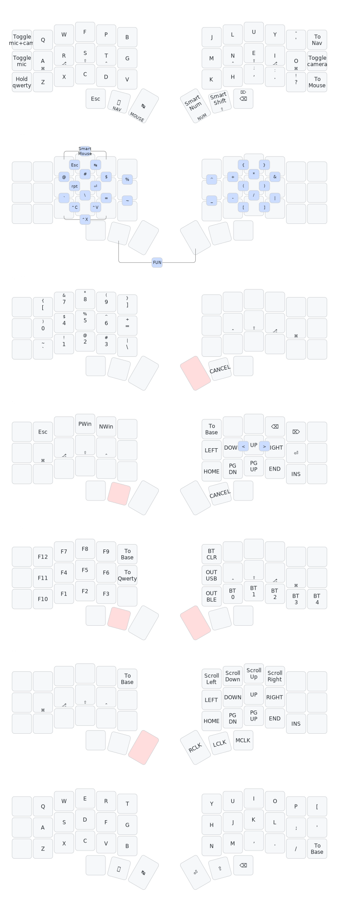

# boggin's zmk-config

This is my personal [ZMK firmware](https://github.com/zmkfirmware/zmk/) configuration.
It is heavily reliant on [urob's zmk-config](https://github.com/urob/zmk-config).
Start there to understand what is going on.

It consists of a 34-keys base layout that is used for my Corneish Zen.

The keymap image was created using [caksoylar's keymap drawer](https://github.com/caksoylar/keymap-drawer).
